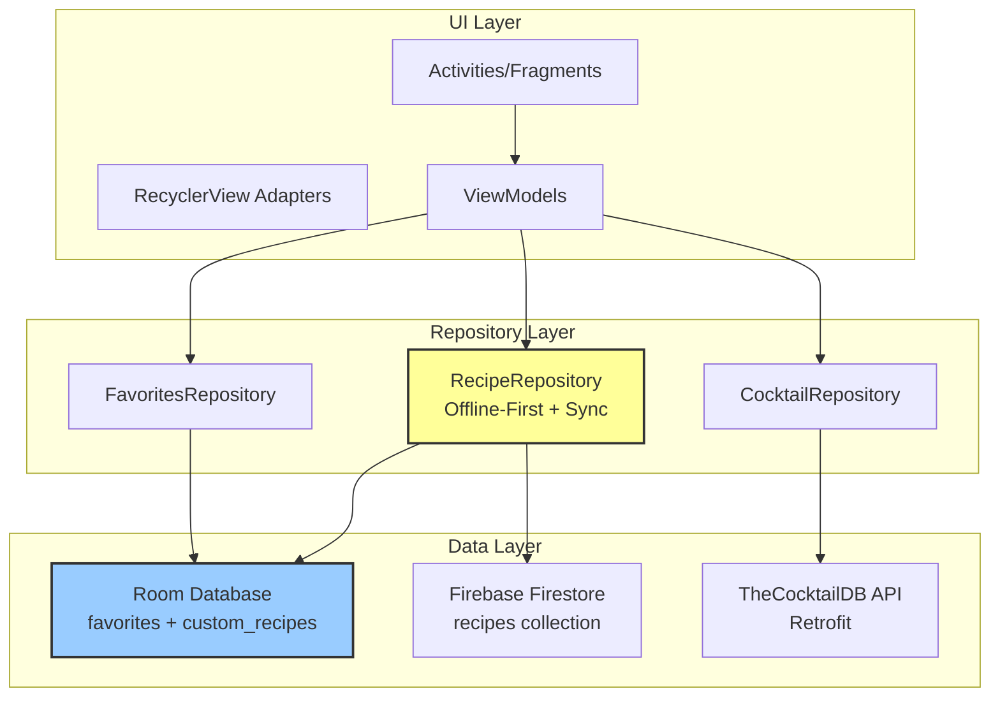

# AGENTS.md
This file provides guidance to Verdent when working with code in this repository.

## Table of Contents
1. Commonly Used Commands
2. High-Level Architecture & Structure
3. Key Rules & Constraints
4. Development Hints

## Commands

### Windows Commands
```bash
# Clean build
gradlew.bat clean

# Build debug APK
gradlew.bat :app:assembleDebug

# Install on connected device/emulator
gradlew.bat :app:installDebug

# Run unit tests
gradlew.bat :app:testDebugUnitTest

# Run single test class
gradlew.bat :app:testDebugUnitTest --tests com.example.mixmate.ExampleUnitTest

# Run instrumented tests (requires running emulator/device)
gradlew.bat :app:connectedDebugAndroidTest

# Lint checks
gradlew.bat :app:lintDebug

# Build release (APK + AAB)
gradlew.bat :app:assembleRelease
gradlew.bat :app:bundleRelease

# Full build with all checks
gradlew.bat build
```

### ADB Commands
```bash
# List connected devices
adb devices

# View app logs
adb logcat | findstr "MixMate"

# Clear app data
adb shell pm clear com.example.mixmate

# Uninstall app
adb uninstall com.example.mixmate
```

### Git Workflow
- Use feature branches from `master`
- Follow Conventional Commits: `feat:`, `fix:`, `docs:`, `refactor:`, `test:`
- Do NOT use `--no-pager` for non-paginating commands (add, commit, push, status)

## Architecture

### System Overview
**MixMate** is a single-module Android cocktail application built with Kotlin using **MVVM + Repository Pattern** with an **offline-first** design strategy.

**Core Pattern**: Local Room DB as source of truth, Firebase for cloud sync and community features, TheCocktailDB API for public cocktail data.

### Technology Stack
- **Language**: Kotlin 2.1.10 (JVM target 11)
- **Build System**: Gradle 8.11.1 with Kotlin DSL, AGP 8.13.1
- **Min SDK**: 26 (Android 8.0) | **Target/Compile SDK**: 36
- **Architecture**: MVVM + Repository Pattern
- **Navigation**: Intent-based with manual footer navigation
- **UI**: XML layouts with Material Design 3, dark brown/gold theme

### Major Subsystems & Responsibilities



### Key Subsystems

#### 1. Authentication & User Management
- **Firebase Auth**: Email/password authentication
- **UserManager**: Singleton for current user state (UID, username, display name)
- **Flow**: MainActivity (login) → DiscoverPage (main app)
- **Profile Storage**: Firestore `users` collection [inferred]

#### 2. Cocktail Discovery (API-based)
- **CocktailApi**: Retrofit interface to TheCocktailDB (`/lookup.php?i={id}`)
- **CocktailRepository**: Fetch public cocktails by ID
- **CocktailMappers**: Converts API's 15 ingredient/measure pairs to formatted string
- **Used by**: Favorites feature to cache cocktail details locally

#### 3. Favorites Management (Offline-First, Local Only)
- **Room Table**: `favorites` (PK: cocktailId + userId)
- **FavoritesRepository**: CRUD operations on local DB
- **Fields**: name, imageUrl, ingredients (formatted string), instructions, savedAt
- **Key Feature**: Works completely offline once cocktails are favorited

#### 4. Custom Recipe Management (Hybrid: Local + Cloud Sync)
- **Room Table**: `custom_recipes` (auto-increment PK, userId scoped)
- **Firestore Collection**: `recipes` (document ID = recipe ID)
- **RecipeRepository**: 
  - Writes to local DB immediately (instant response)
  - Syncs to Firebase in background (async, non-blocking)
- **Features**: 
  - Create, update, delete custom recipes
  - Search local recipes by name
  - Filter by difficulty
  - Community recipes (public, real-time)
  - Like/unlike recipes (atomic Firestore transaction)

#### 5. My Bar (Ingredient Inventory)
- **Purpose**: Track user's available ingredients, suggest cocktails
- **Activity**: `MyBar.kt`
- **Adapter**: `BarItemAdapter`, `SuggestedCocktailAdapter`

#### 6. Navigation & UI
- **Entry Point**: `MainActivity` (login screen)
- **Main App**: `DiscoverPage` (post-login landing)
- **Footer Navigation**: 5 tabs (Home, Discover, List/MyBar, Favorites, Profile)
- **Navigation Strategy**: Intent-based, no Navigation Architecture Component
- **Base Class**: `BaseActivity` (auto-wires footer for extending activities)

### Data Flow & Request/Response Lifecycles

#### Offline-First Read Pattern (Custom Recipes)
```
User opens screen
  → ViewModel.getAllRecipes(userId)
  → RecipeRepository.getAllRecipes(userId): Flow<List>
    ├─ Room DAO query (immediate emission)
    └─ Background: syncWithFirebase(userId) [placeholder]
  → UI updates immediately with local data
```

#### Create Custom Recipe Flow
```
User submits recipe
  → RecipeRepository.saveRecipe(recipe, userId, isPublic)
    ├─ Room: insert into custom_recipes → returns local ID
    ├─ Result.success(id) returned to UI immediately
    └─ Async: 
        ├─ Convert to FirebaseRecipe
        └─ Firestore: save to recipes collection
  → UI shows success, recipe appears in list
```

#### Favorite Cocktail Flow
```
User clicks favorite button
  → Fetch from CocktailApi.lookupById(id)
  → CocktailMappers.formatIngredients(drink)
  → FavoritesRepository.upsert(FavoriteEntity)
    └─ Room: insert/update favorites table
  → No Firebase sync for favorites (local-only)
```

#### Community Recipes Real-Time Flow
```
User opens Discover tab
  → RecipeRepository.getCommunityRecipes(): Flow<List<FirebaseRecipe>>
  → FirebaseRecipeRepository.getPublicRecipes()
    └─ Firestore: snapshot listener on recipes WHERE isPublic=true LIMIT 50
  → callbackFlow emits on any change (new, update, delete)
  → UI updates in real-time
```

### External Dependencies
- **TheCocktailDB API**: `https://www.thecocktaildb.com/api/json/v1/1/` (public cocktail data)
- **Firebase Services**: Auth, Firestore, Storage (BOM 33.7.0)
- **Retrofit**: 2.11.0 (REST client)
- **Room**: 2.8.1 (local SQLite)
- **Glide**: 4.16.0 (image loading)
- **Coroutines**: 1.8.1 (async operations)

### Development Entry Points

#### For UI Changes
- **Layouts**: `app/src/main/res/layout/`
- **Activities**: `app/src/main/java/com/example/mixmate/` (root package)
- **Adapters**: `app/src/main/java/com/example/mixmate/` (root package, `*Adapter.kt` files)
- **ViewModels**: `app/src/main/java/com/example/mixmate/ui/*/`

#### For Data/Backend Changes
- **Room Entities**: `app/src/main/java/com/example/mixmate/data/local/*Entity.kt`
- **DAOs**: `app/src/main/java/com/example/mixmate/data/local/*Dao.kt`
- **Repositories**: `app/src/main/java/com/example/mixmate/data/repo/` or `.../data/repository/`
- **API**: `app/src/main/java/com/example/mixmate/data/remote/CocktailApi.kt`
- **Firebase**: `app/src/main/java/com/example/mixmate/data/remote/FirebaseRecipeRepository.kt`

#### For Testing
- **Unit Tests**: `app/src/test/java/com/example/mixmate/`
- **Instrumented Tests**: `app/src/androidTest/java/com/example/mixmate/`
- **Test Framework**: JUnit 4.13.2, AndroidJUnit4, Espresso 3.7.0

## Key Rules & Constraints

### From README.md & Project Analysis

1. **Offline-First Architecture Mandate**
   - Room database is the single source of truth for custom recipes and favorites
   - All user-facing operations must work without network connectivity
   - Firebase sync happens asynchronously in background (non-blocking)
   - Never block UI waiting for network operations

2. **User Data Isolation**
   - All database queries MUST filter by `userId` (Firebase UID)
   - Both `favorites` and `custom_recipes` tables require userId field
   - Firebase Firestore recipes also scoped by userId for ownership

3. **Navigation Architecture**
   - Intent-based navigation (no Jetpack Navigation Component)
   - Bottom navigation footer managed by `BaseActivity` (5 tabs)
   - Activities extending BaseActivity get automatic footer setup
   - Use `startActivity(Intent)` for screen transitions
   - **Known Bug**: `BaseActivity.kt:51` - LIST tab incorrectly navigates to MainActivity instead of MyBar

4. **Data Conversion Requirements**
   - TheCocktailDB API returns 15 ingredient/measure pairs → must use `CocktailMappers.formatIngredients()` to create newline-separated string
   - Custom recipes use JSON serialization for ingredients list (GSON TypeConverter)
   - Use extension functions for `CustomRecipeEntity ↔ FirebaseRecipe` conversions

5. **Firebase Constraints**
   - API key stored in `local.properties` (NOT committed to git)
   - Access via `BuildConfig.API_KEY` in code
   - `google-services.json` required for Firebase integration
   - Real-time listeners use `callbackFlow` pattern with proper cleanup (`awaitClose`)

6. **Async Patterns**
   - All IO operations must use Kotlin coroutines (`suspend` functions)
   - Repository methods returning lists use `Flow<List<T>>` for reactive updates
   - Firebase sync happens in `CoroutineScope.launch { }` (fire-and-forget)
   - ViewModels should collect Flows in `viewModelScope`

7. **Testing Requirements**
   - Unit tests: Target 80%+ code coverage (JUnit 4)
   - Instrumented tests require running emulator/device
   - Use MockWebServer 4.12.0 for API testing
   - Test runner: `androidx.test.runner.AndroidJUnitRunner`

8. **Material Design 3 & Theming**
   - Use dark theme with brown/gold color palette
   - Primary theme: `@style/Theme.MixMate`
   - No action bar for some screens: `@style/Theme.MixMate.NoActionBar`
   - RecyclerView for all list-based UIs (6 custom adapters)

9. **Version Catalog Dependency Management**
   - All dependencies declared in `gradle/libs.versions.toml`
   - Access via `libs.*` in build scripts
   - NEVER hardcode version numbers in `build.gradle.kts`
   - Use Firebase BOM (33.7.0) for Firebase library versions

10. **Git & CI/CD**
    - GitHub Actions with Super Linter (`.github/workflows/superlinter.yml`)
    - Triggers on push to any branch
    - Feature branches from `master` (main branch)
    - Conventional Commits required

11. **Security**
    - Never commit `local.properties` or `google-services.json`
    - API keys via BuildConfig, not hardcoded strings
    - Firebase rules for Firestore access control [inferred]

12. **Code Organization**
    - Activities in root package (`com.example.mixmate`)
    - Data layer in `data/` subpackages (local, remote, repo, repository)
    - UI components in `ui/` subpackages
    - Adapters in root package (legacy structure)

## Development Hints

### Adding a New API Endpoint

1. **Define in CocktailApi interface** (`data/remote/CocktailApi.kt`)
   ```kotlin
   @GET("endpoint.php")
   suspend fun newEndpoint(@Query("param") param: String): NewResponse
   ```

2. **Create response models** in `data/remote/CocktailModels.kt`
   ```kotlin
   data class NewResponse(val data: List<Item>)
   ```

3. **Add repository method** in `CocktailRepository.kt`
   ```kotlin
   suspend fun getNewData(param: String): Item? {
       return api.newEndpoint(param).data.firstOrNull()
   }
   ```

4. **Use in ViewModel/Activity** with coroutine
   ```kotlin
   lifecycleScope.launch {
       val result = CocktailRepository.getNewData("value")
       // Update UI
   }
   ```

### Adding a New Database Table

1. **Create Entity** in `data/local/`
   ```kotlin
   @Entity(tableName = "new_table")
   data class NewEntity(
       @PrimaryKey val id: String,
       val userId: String,
       val field: String
   )
   ```

2. **Create DAO** in `data/local/`
   ```kotlin
   @Dao
   interface NewDao {
       @Query("SELECT * FROM new_table WHERE userId = :userId")
       fun getAll(userId: String): Flow<List<NewEntity>>
       
       @Insert(onConflict = OnConflictStrategy.REPLACE)
       suspend fun insert(entity: NewEntity)
   }
   ```

3. **Update AppDatabase** (`data/local/AppDatabase.kt`)
   ```kotlin
   @Database(
       entities = [FavoriteEntity::class, CustomRecipeEntity::class, NewEntity::class],
       version = 4 // increment version
   )
   abstract class AppDatabase : RoomDatabase() {
       abstract fun newDao(): NewDao
   }
   ```

4. **Add migration** (if modifying existing schema)
   ```kotlin
   val MIGRATION_3_4 = object : Migration(3, 4) {
       override fun migrate(database: SupportSQLiteDatabase) {
           database.execSQL("CREATE TABLE IF NOT EXISTS new_table ...")
       }
   }
   ```

5. **Create Repository** in `data/repo/`
   ```kotlin
   class NewRepository {
       private val dao = MixMateApp.db.newDao()
       
       fun getAll(userId: String) = dao.getAll(userId)
       suspend fun insert(entity: NewEntity) = dao.insert(entity)
   }
   ```

### Adding a New Activity with Footer Navigation

1. **Create Activity extending BaseActivity**
   ```kotlin
   class NewActivity : BaseActivity() {
       override fun activeTab() = FooterTab.HOME // or appropriate tab
       
       override fun onCreate(savedInstanceState: Bundle?) {
           super.onCreate(savedInstanceState)
           setContentView(R.layout.activity_new)
           // Footer automatically wired
       }
   }
   ```

2. **Create layout with footer include**
   ```xml
   <LinearLayout android:orientation="vertical">
       <!-- Main content -->
       
       <include layout="@layout/footer_navigation" />
   </LinearLayout>
   ```

3. **Register in AndroidManifest.xml**
   ```xml
   <activity
       android:name=".NewActivity"
       android:exported="false" />
   ```

4. **Navigate from other activities**
   ```kotlin
   startActivity(Intent(this, NewActivity::class.java))
   ```

### Implementing Offline-First Feature

1. **Create Room Entity** (see "Adding a New Database Table")

2. **Create Repository with dual-write pattern**
   ```kotlin
   class FeatureRepository {
       private val dao = MixMateApp.db.featureDao()
       private val firebaseRepo = FirebaseFeatureRepository()
       private val scope = CoroutineScope(Dispatchers.IO)
       
       fun getAll(userId: String): Flow<List<Entity>> {
           // Return local data immediately
           val localFlow = dao.getAll(userId)
           
           // Background sync (non-blocking)
           scope.launch {
               syncWithFirebase(userId)
           }
           
           return localFlow
       }
       
       suspend fun save(entity: Entity, userId: String): Result<Long> {
           // Write to local DB first (instant)
           val localId = dao.insert(entity)
           
           // Async Firebase sync
           scope.launch {
               firebaseRepo.save(entity.toFirebase(userId))
           }
           
           return Result.success(localId)
       }
   }
   ```

3. **Use Flow in ViewModel**
   ```kotlin
   class FeatureViewModel : ViewModel() {
       private val repo = FeatureRepository()
       
       val items: StateFlow<List<Entity>> = repo.getAll(userId)
           .stateIn(viewModelScope, SharingStarted.Lazily, emptyList())
   }
   ```

### Modifying CI/CD Pipeline

**Note**: Current CI uses Super Linter (`.github/workflows/superlinter.yml`) - only lints on push, does NOT run builds or tests.

**To add build checks:**
1. Create `.github/workflows/android.yml`
2. Add build step:
   ```yaml
   - name: Build Debug APK
     run: ./gradlew :app:assembleDebug
   ```
3. Add test step:
   ```yaml
   - name: Run Unit Tests
     run: ./gradlew :app:testDebugUnitTest
   ```

**Existing workflow triggers**: Push to any branch (no PR checks configured)

### Fixing Known Navigation Bug

**Issue**: `BaseActivity.kt:51` - LIST tab navigates to MainActivity instead of MyBar

**Fix**:
```kotlin
// In BaseActivity.kt:51
list?.setOnClickListener { goIfNotCurrent(MyBar::class.java) }  // Fixed
```

**Also fix**: `MyBar.kt:52` - Remove "coming soon" toast, implement proper FavouritesActivity navigation
```kotlin
navFav?.setOnClickListener {
    startActivity(Intent(this, FavouritesActivity::class.java))
}
```

### Working with Firebase Real-Time Listeners

**Pattern**: Use `callbackFlow` for converting Firestore snapshots to Kotlin Flow

```kotlin
fun getRealtimeData(): Flow<List<Item>> = callbackFlow {
    val listener = firestore.collection("items")
        .addSnapshotListener { snapshot, error ->
            if (error != null) {
                close(error)
                return@addSnapshotListener
            }
            
            val items = snapshot?.documents?.mapNotNull { 
                it.toObject(Item::class.java) 
            } ?: emptyList()
            
            trySend(items)
        }
    
    awaitClose { listener.remove() }  // Cleanup on cancellation
}
```

### Best Practices for RecyclerView Adapters

**Existing pattern** (see `FavoritesAdapter.kt`, `SuggestedCocktailAdapter.kt`):
1. **ViewHolder** inner class with view bindings
2. **Click listeners** passed as constructor lambdas
3. **DiffUtil** for efficient updates [not currently used, but recommended]
4. **Glide** for image loading with placeholders

**Example**:
```kotlin
class NewAdapter(
    private val onItemClick: (Item) -> Unit
) : RecyclerView.Adapter<NewAdapter.ViewHolder>() {
    
    private var items = emptyList<Item>()
    
    fun submitList(newItems: List<Item>) {
        items = newItems
        notifyDataSetChanged()  // Consider using DiffUtil
    }
    
    inner class ViewHolder(view: View) : RecyclerView.ViewHolder(view) {
        fun bind(item: Item) {
            // Bind data
            itemView.setOnClickListener { onItemClick(item) }
        }
    }
}
```

### Debugging Tips

1. **Logging**: Use `android.util.Log` or create SafeLog utility (see `SafeLog.kt`)
2. **Database inspection**: Use Android Studio's Database Inspector
3. **Network inspection**: Use Logcat with filter `System.out` for Retrofit logs
4. **Firebase debugging**: Enable Firestore debug logging:
   ```kotlin
   FirebaseFirestore.setLoggingEnabled(true)
   ```
5. **Emulator**: Use AVD Manager in Android Studio, API 26+ required

### Performance Optimization

1. **RecyclerView**: Use `setHasFixedSize(true)` if size doesn't change
2. **Glide**: Enable disk caching (default enabled)
3. **Room**: Use `@Query` with Flow instead of LiveData for better performance
4. **Coroutines**: Use `Dispatchers.IO` for database/network operations
5. **Firebase**: Limit query results (e.g., `limit(50)` for public recipes)

### Common Build Issues

- **Java version mismatch**: Ensure Java 17 installed (`java -version`)
- **Gradle sync fails**: Invalidate caches in Android Studio → File → Invalidate Caches / Restart
- **Firebase errors**: Ensure `google-services.json` exists in `app/`
- **API key missing**: Add `API_KEY=your_key` to `local.properties`
- **Room schema errors**: Increment database version, add migration
